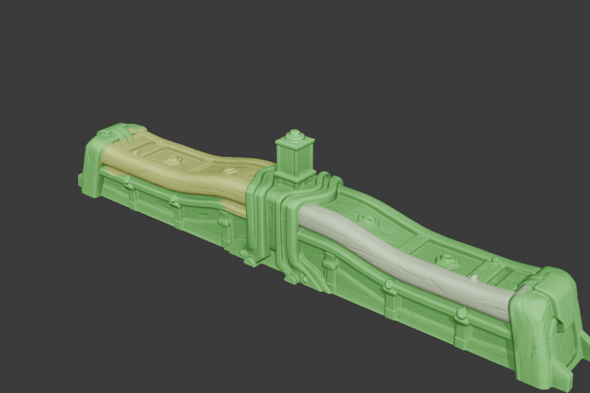

# Hunyuan3D-Part 完整 MLX 移植与验证报告

日期：2026-08-11。[verified: 本次执行环境日期]

分支：`codex/official-p3sam-complete-port`。[verified: Mac `git branch --show-current`]

## 1. 最终结论

公开发布范围内的 Hunyuan3D-Part 已完成 Apple Silicon 原生 MLX 推理移植：P3-SAM、Conditioner、PartFormer 和 ShapeVAE 均有可执行 MLX 路径，P3-SAM 后接完整公开 `auto_mask.py` 网格拓扑语义，X-Part 可执行 50 步生成并导出独立几何。[verified: `src/split3d/hunyuan/`、`artifacts/xpart_corrected_steps50_r128/runtime.json`]

P3-SAM 的 MLX 神经网络路径没有导入 PyTorch 或调用 CUDA；PyTorch 只存在于 Windows CUDA 参考脚本中。[verified: `rg "import torch|cuda" src/split3d/hunyuan` 无神经网络命中；`scripts/run_p3sam_cuda_reference.py` 为独立参考实现]

工程移植已完成，但不能声称复现论文 `81.14` mIoU。[verified: `.upstream/papers/p3-sam.txt:317-330`；`reports/p3sam-paper-protocol-single-sample.json`] 论文的 connectivity 结果使用每个 GT part 的随机 prompt，公开仓库没有给出对应评测/联合 mask 选择代码；公开 issue #13 也报告 release 结果约为 60% 而不是 81.14。[verified: `.upstream/papers/p3-sam.txt:419-423,961-970`；`reports/p3sam-attention-precision-ab.json` → `official_release_reproduction_issue`]

公开 X-Part 是 light version，不是论文 full checkpoint，因此本移植只能完整复刻公开模型，不能伪造未发布模型的论文指标。[verified: `.upstream/hunyuan3d-part/README.md:39-40`]

## 2. 已移植的真实推理链路

### P3-SAM

1. `trimesh.sample.sample_surface` 使用源面索引采样 100,000 个表面点，并保留 float64 归一化和官方 Sonata 数据变换顺序。[verified: `src/split3d/hunyuan/p3sam_pipeline.py:225-341`；`src/split3d/hunyuan/sonata_data.py`]
2. Sonata、两阶段三头 mask decoder 和 IoU predictor 在 MLX 上执行。[verified: `src/split3d/hunyuan/sonata_mlx.py`；`src/split3d/hunyuan/p3sam_mlx.py`]
3. 400 个官方 seeded-FPS prompts 产生候选 mask，随后执行公开代码的 IoU 排序、NMS 聚类、稳定候选筛选和未覆盖区域补充。[verified: `src/split3d/hunyuan/p3sam_pipeline.py:105-203,315-341`]
4. point labels 按源 `face_idx` 投票回原网格，再执行邻接 flood-fill、连通区域拆分、漏分区补齐和累计面积小部件合并。[verified: `src/split3d/hunyuan/p3sam_official_postprocess.py:329-432`]
5. 输出 projected、connectivity、full-postprocess 三阶段标签、彩色 GLB/PLY、AABB、`parts.json` 和每个 part 的独立 GLB。[verified: `src/split3d/hunyuan/p3sam_pipeline.py:389-473`]

当输入 point labels 相同时，本地 topology 端口与固定官方代码路径逐面一致。[verified: `tests/test_hunyuan_p3sam_official_postprocess.py` 和 pinned topology fixtures]

### X-Part

P3-SAM 的分割和 AABB 进入 MLX Conditioner；PartFormer 执行 flow matching；ShapeVAE 解码每个 part 的 SDF，并通过 Marching Cubes 导出组合场景。[verified: `src/split3d/hunyuan/xpart_pipeline_mlx.py`、`xpart_conditioner_mlx.py`、`xpart_partformer_mlx.py`、`xpart_shapevae_mlx.py`]

已有一次公开 light 权重的完整 50 步单实例运行：10 parts、总耗时 230.3896 秒、峰值统一内存 29.4949 GB。[verified: `artifacts/xpart_corrected_steps50_r128/runtime.json`] 该产物生成于 P3-SAM float64 预处理修复之前，因此证明完整网络和导出链路可运行，但不能作为当前 preprocessing 的最终精度复测。[verified: artifact 时间顺序与后续 float64 修复提交]

## 3. 权重大小

| 模块 | 字节 | 约十进制大小 | 证据 |
|---|---:|---:|---|
| P3-SAM | 450,968,044 | 451 MB | [verified: Mac `stat models/p3sam.safetensors`] |
| PartFormer | 6,630,571,584 | 6.63 GB | [verified: Mac `stat model/model.safetensors`] |
| Conditioner | 1,755,920,004 | 1.76 GB | [verified: Mac `stat conditioner/conditioner.safetensors`] |
| ShapeVAE | 655,539,474 | 656 MB | [verified: Mac `stat shapevae/shapevae.safetensors`] |
| 合计 | 9,492,999,106 | 9.49 GB / 8.84 GiB | [verified: 上述四个文件之和] |

## 4. 固定输入 CUDA / MLX 对齐

固定样本为 `00200996b8f34f55a2dd2f44d316d107`，两端重放相同 mesh hash、100,000 sampled points、normals、`face_idx`、400 prompt indices 和 seed 42。[verified: `artifacts/fixed_replay_002_float64/replay_manifest.npz`]

| 后端 | projected mIoU | connectivity mIoU | full mIoU | 推理时间 | 峰值内存 | 证据 |
|---|---:|---:|---:|---:|---:|---|
| CUDA FP32 / RTX 4070 | 24.8356 | 31.5899 | 33.2772 | 33.3415 s | 8.1520 GB | [verified: `artifacts/fixed_replay_002_float64/cuda/{stage_metrics,runtime}.json`] |
| MLX FP32 / Apple GPU | 26.2231 | 35.6017 | 37.5393 | 38.2448 s | 3.5270 GB | [verified: `artifacts/fixed_replay_002_float64/mlx/{stage_metrics,runtime}.json`] |

这个单样本上 MLX full mIoU 高 4.2622 个百分点，但它不能证明总体上 MLX 比 CUDA 更准。[verified: 上表差值；样本数为 1]

CUDA prompt batch 8 改为 4 后，predicted IoU、candidate masks、point labels 和三个 face-label 阶段逐值一致，峰值显存从 8.1520 GB 降至 4.4168 GB。[verified: `artifacts/fixed_replay_002_float64/cuda_bs8_vs_bs4.json`]

## 5. 注意力精度选择

官方 Sonata 将 QKV 转为 FP16 后调用 FlashAttention，再转回模型 dtype。[verified: `.upstream/hunyuan3d-part/XPart/partgen/models/sonata/model.py`]

MLX 0.32.0 直接 FP16 SDPA 在 20K 点测试中产生 10,240,000 个 NaN feature，因此不能作为生产默认值。[verified: `reports/p3sam-attention-precision-ab.json` → `attention_contract.mlx_direct_fp16_sdpa`]

五个相同 100K 样本的 CUDA 配对测试中，官方 FP16 attention 比 FP32 的 full mIoU 平均低 1.0717 个百分点；FP16 节省约 3.7346 GB 显存并快约 0.9632 秒。[verified: `reports/p3sam-attention-precision-ab.json` → `paired_cuda_means`]

因此默认保留 FP32 attention；这是基于公开权重和当前 MLX 版本的实测精度选择，不是对论文训练配置的修改。[verified: `reports/p3sam-attention-precision-ab.json` → `default_selected`]

## 6. 论文协议边界

论文 PartObj-Tiny 表 2 报告 automatic without-connectivity `59.88`、GT-prompt connectivity `81.14`、interactive `51.23`。[verified: `.upstream/papers/p3-sam.txt:317-330`]

论文明确说明 connectivity 任务引入 connected components，并为每个真实 part 使用随机 prompt；附录 A.5 只描述从每个 prompt 的三张 mask 中由小到大联合选择，没有发布确定性的 tie-breaking 实现。[verified: `.upstream/papers/p3-sam.txt:419-423,961-970`]

本项目实现了明确标记为 oracle audit 的可审计重建器，不把它接入自动服务。[verified: `src/split3d/hunyuan/p3sam_paper_protocol.py`；`scripts/benchmark_p3sam_paper_oracle.py`]

固定单样本中，论文描述的 GT-prompt 重建把 full mIoU 从 37.5393 提高到 48.1209，但仍远低于 81.14；一个不使用 GT 的质心 prompt 二次细化反而降到 31.4829，已被移除。[verified: `reports/p3sam-paper-protocol-single-sample.json`]

新 automatic benchmark 按用户要求在 147/200 停止；其 full shape-micro 均值为 42.2417，只是按文件名排序的非随机前缀诊断，不得当作论文 200 样本结果。[verified: `artifacts/official_paper_protocol_mlx_200_float64_batch1/summary.json`；`reports/p3sam-paper-protocol-single-sample.json`]

## 7. 真实栏杆模型结果

输入为 `inputs/curved-lantern-balustrade-final.glb`，通过外部 `8080` 队列提交给本机 `8083` MLX worker。[verified: queue task `75bb60f5-72f1-4fb4-8caa-82f68209632a`]

任务一次成功，P3-SAM 总耗时 36.5579 秒；服务冷加载计入的 MLX 峰值统一内存为 21.9761 GB。[verified: `artifacts/service_balustrade_75bb60f5/extracted/runtime.json`]

任务 ID、输入/输出哈希、runtime、part 统计、bundle 清单和 API 检查已固化在仓库报告中。[verified: `reports/balustrade-service-validation.json`]

最终网格有 82,468 vertices、164,940 faces、3 parts、0 个未分配面；三个独立 GLB 的 face 数之和等于完整网格 face 数。[verified: `artifacts/service_balustrade_75bb60f5/part_analysis.json` 和 `parts.json`]

| part label | faces | 面积占比 | 连通组件数 | 证据 |
|---:|---:|---:|---:|---|
| 0 | 135,793 | 80.7758% | 1 | [verified: `part_analysis.json`] |
| 30 | 22,907 | 14.4548% | 1 | [verified: `part_analysis.json`] |
| 399 | 6,240 | 4.7694% | 1 | [verified: `part_analysis.json`] |



预览显示左右弯曲扶手被分出，而主体、中央结构和大量细节合并在最大 part；这是明显的真实欠分割，不能仅凭“3 个连通 part”判定语义质量合格。[verified: 上述预览和面积分布]

## 8. X-Part 单实例几何指标

旧 50 步产物输入为固定 PartObjaverse 样本，resolution 128 输出 10 个 geometry、73,754 vertices 和 144,477 faces。[verified: `artifacts/xpart_corrected_steps50_r128/{runtime,surface_metrics}.json`]

合并生成表面对输入 mesh 的 sanity metrics 为 CD `0.011736`、F@0.1 `0.997659`、F@0.05 `0.946388`，且并非全部 watertight。[verified: `artifacts/xpart_corrected_steps50_r128/surface_metrics.json`]

这些数值不是论文的 GT part-to-part decomposition 指标，不能与论文数字直接比较。[verified: `scripts/evaluate_xpart_surface.py` 只比较合并表面与输入 mesh]

## 9. 外部 API 与 agent 可发现性

`8080` 是持久化外部队列，`8083` 是只监听 localhost 的 MLX worker。[verified: `deploy/3d-inference/start_services.py`]

两个服务的 `/docs` 均返回 HTTP 200，且 `/openapi.json` 可列出以下接口。[verified: 本次 Mac curl/jq 输出]

- Queue：`/submit/part`、`/status/{uid}`、`/download/{uid}`、`/bundle/{uid}`、`/tasks/recent`、`/queue`、`/health`、`/ready`。[verified: `8080/openapi.json`]
- Worker：`/send`、`/status/{uid}`、`/download/{uid}`、`/bundle/{uid}`、`/tasks/recent`、`/health`、`/unload`。[verified: `8083/openapi.json`]

真实任务验证了 submit → processing → completed → download/bundle 全链路，且 X-Part 没有在 segment 请求中误加载。[verified: task `75bb60f5-...`；worker health `p3sam_loaded=true,xpart_loaded=false`]

artifact ZIP 现在递归包含 `parts/*.glb`，并保留 projected/connectivity/final 三阶段标签和全部可视化。[verified: `src/split3d/hunyuan/service.py` 和新版 bundle 清单]

## 10. 使用方式

```bash
# 外部队列：真实 P3-SAM 分割
curl -X POST --data-binary @input.glb \
  'http://MAC_IP:8080/submit/part?filename=input.glb&mode=segment'

# 查询和下载
curl http://MAC_IP:8080/status/TASK_UID
curl http://MAC_IP:8080/download/TASK_UID -o segmented.glb
curl http://MAC_IP:8080/bundle/TASK_UID -o artifacts.zip

# Swagger / OpenAPI
open http://MAC_IP:8080/docs
curl http://MAC_IP:8080/openapi.json
```

## 11. 验收判定

- 公开模型范围的 MLX 网络与完整 P3-SAM topology/postprocess 已实现。[verified: 源码、固定 replay、单元测试和真实服务任务]
- CUDA/MLX 数值差异已用固定输入逐阶段记录，FP32 是当前实测更稳且更准的默认 attention 路径。[verified: `reports/p3sam-attention-precision-ab.json`]
- 真实外部服务可提交 GLB、查询状态、下载最终 GLB 和完整嵌套 artifact bundle。[verified: task `75bb60f5-...`]
- 真实栏杆结果存在欠分割，当前公开权重不应被宣传为该领域的 production-quality semantic part segmentation。[verified: 3-part 预览和 80.7758% 最大 part]
- 论文 81.14 和 X-Part full checkpoint 指标无法由当前公开发布物严格复现。[verified: 论文 GT-prompt 条件、缺失评测代码、公开 light checkpoint]

要进一步提高栏杆/建筑构件的真实精度，最高价值方向是使用该领域的 part 标注微调 P3-SAM mask/IoU heads，或取得作者未发布的 connectivity 评测与 full X-Part checkpoint。[opinion]
